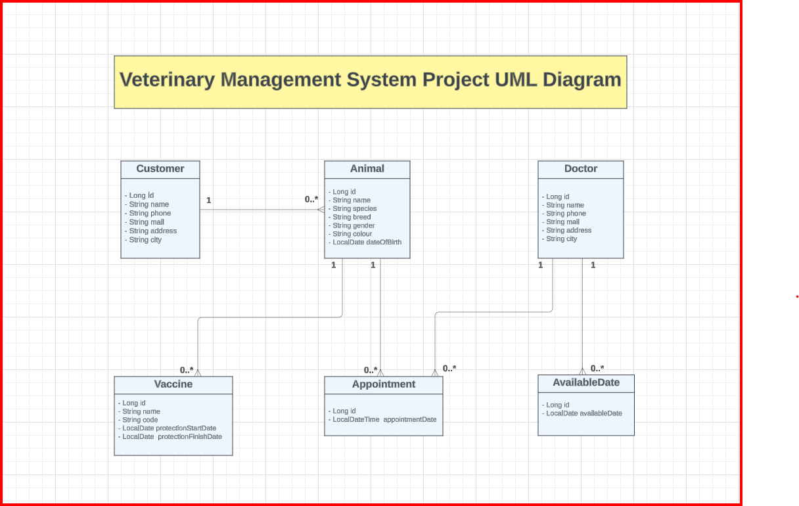

# Veterinary Management System API 

🐾**This project includes a RESTful API for a veterinary clinic to manage its operations.**

**Veterinary employees can use this application to:**

- Register veterinary doctors,
- Record doctors' working days (available days),
- Register customers(owners),
- Record animals belonging to customers(owners),
- Record administered vaccines for animals along with their dates,
- Create appointments for animals with veterinary doctors,
- Enter the date and time when creating appointments,
- Check the availability of the doctor's schedule when creating appointments.

### 🎯**Project Objectives:**

- Providing a tool for veterinary clinics to manage their operations more efficiently.
- Systematically storing and making accessible the information of veterinary doctors, customers, and animals.
- Facilitating the tracking of administered vaccines and providing veterinary doctors with the ability to create and manage appointments.

### 🛠️**Technologies Used in the Project:**
- Spring Boot
- Spring Data JPA
- PostgreSQL (database)
- Maven (dependency management)
- Lombok (to reduce code repetition in Java)

### 📁**Layered Architecture of the Project:**

- **API Layer:** Handles incoming requests and generates responses.
- **Business Layer:** Processes the business logic.
- **DAO (Data Access Object) Layer:** Performs database operations.
- **DTO (Data Transfer Object) Layer:** Facilitates the transfer of data.
- **Core Layer:** Contains fundamental business logic and general functions.
- **Entity Layer:** Includes database entity classes.

----
### 📝UML Diagram:

**The UML diagram created at the beginning of the project is as follows:**

----

### 🌐**API Endpoints**

#### **Below is a summary outlining the key features of the API:**

- **Management of Animals and Customers(Owners):** Registering, updating, viewing, deleting animals and their owners, list the animals filtered by name,list all animals by owners and list the filtered owners by name. 
- **Management of Administered Vaccines:** Recording, updating, viewing, deleting vaccines administered to animals, checking expiration dates, list vaccine records and list vaccines within a specific date range.
- **Appointment Management:** Creating, updating, viewing, deleting appointments for animal and doctor, filtering appointments,checking the availability of the doctor.
- **Veterinary Doctor Management:** Registering, updating, viewing, and deleting veterinary doctors.
- **Management of Doctor's Available Days:** Adding, updating, viewing, deleting available days for veterinary doctors and list available days.

### 🔗Veterinary Management System API Detailed Endpoints Documentation

### Customers API

#### 1. Save Customer (Creates a new customer record.)

*Endpoint:* POST /v1/customers

#### 2. Customer Details (Gets the details of a specific customer..)

*Endpoint:* GET /v1/customers/{id}

#### 3. Paged Customer List (Gets a paged list of customers)

*Endpoint:* GET /v1/customers

#### 4. Update Customer (Updates the details of a customer)

*Endpoint:* PUT /v1/customers

#### 5. Delete Customer (Deletes a specific customer)

*Endpoint:* DELETE /v1/customers/{id}

#### 6. Customer's Animals (Gets the animals owned by a customer.)

*Endpoint:* GET /v1/customers/{customerId}/animals

#### 7. Find Customer by Name (Finds customers by name)

*Endpoint:* GET /v1/customers/nameByCustomer/{name}

---

### Animals API

#### 1. Save Animal (Creates a new animal record.)

*Endpoint:* POST /v1/animals

#### 2. Animal Details (Gets the details of a specific animal.)

*Endpoint:* GET /v1/animals/{id}

#### 3. Paged Animal List (Retrieves a paged list of animals.)

*Endpoint:* GET /v1/animals

#### 4. Update Animal (Updates the details of an animal.)

*Endpoint:* PUT /v1/animals

#### 5. Delete Animal (Deletes a specific animal.)

*Endpoint:* DELETE /v1/animals/{id}

#### 6. Animal's Vaccines (Gets the vaccination history of an animal.)

*Endpoint:* GET /v1/animals/{animalId}/vaccines

#### 7. Find Animal by Name (Finds animals by name.)

*Endpoint:* GET /v1/animals/findName/{name}

-------

### Appointments API

#### 1. Save Appointment (Creates a new appointment record.)

*Endpoint:* POST /v1/appointments

#### 2. Appointment Details (Gets the details of a specific appointment.)

*Endpoint:* GET /v1/appointments/{id}

#### 3. Paged Appointment List (Gets a paged list of appointments)

*Endpoint:* GET /v1/appointments

#### 4. Update Appointment (Updates the details of an appointment.)

*Endpoint:* PUT /v1/appointments

#### 5. Delete Appointment (Deletes a specific appointment.)

*Endpoint:* DELETE /v1/appointments/{id}

#### 6. Filter Appointments by Date and Doctor (Filters appointments by a specific date range and a specific doctor.)

*Endpoint:* GET /v1/appointments/byDrId

#### 7. Filter Appointments by Date and Animal (Filters appointments by a specific date range and a specific animal.)

*Endpoint:* GET /v1/appointments/byAnimalId

-------
### Available Dates API

#### 1. Save Available Date (Creates a new available date record.)

*Endpoint:* POST /v1/availableDates

#### 2. Available Date Details (Gets the details of a specific available date.)

*Endpoint:* GET /v1/availableDates/{id}

#### 3. Paged Available Date List (Gets a paged list of available dates.)

*Endpoint:* GET /v1/availableDates

#### 4. Update Available Date (Updates the details of an available date.)

*Endpoint:* PUT /v1/availableDates

#### 5. Delete Available Date (Deletes a specific available date.)

*Endpoint:* DELETE /v1/availableDates/{id}

-----

### Doctors API

#### 1. Save Doctor (Creates a new doctor record.)

*Endpoint:* POST /v1/doctors

#### 2. Doctor Details (Gets the details of a specific doctor.)

*Endpoint:* GET /v1/doctors/{id}

#### 3. Paged Doctor List (Gets a paged list of doctors.)

*Endpoint:* GET /v1/doctors

#### 4. Update Doctor (Updates the details of a doctor.)

*Endpoint:* PUT /v1/doctors

#### 5. Delete Doctor (Deletes a specific doctor.)

*Endpoint:* DELETE /v1/doctors/{id}

-----

### Vaccines API

#### 1. Save Vaccine (Creates a new vaccine record.)

*Endpoint:* POST /v1/vaccines

#### 2. Vaccine Details (Gets the details of a specific vaccine.)

*Endpoint:* GET /v1/vaccines/{id}

#### 3. Paged Vaccine List (Gets a paged list of vaccines.)

*Endpoint:* GET /v1/vaccines

#### 4. Update Vaccine (Updates the details of a vaccine.)

*Endpoint:* PUT /v1/vaccines

#### 5. Delete Vaccine (Deletes a specific vaccine.)

*Endpoint:* DELETE /v1/vaccines/{id}

#### 6. Filter Vaccines by Expiry Date (Filters vaccines by a specific expiry date range.)

*Endpoint:* GET /v1/vaccines/protection

----

### 🚀Installation

You can follow these steps to use the project:

1. Clone the repository: git clone https://github.com/Rabiacagli/Hafta-12
2. Navigate to the project directory: cd project-directory
3. Install dependencies: Maven will automatically download the required dependencies.
4. VeterinaryDatabase.sql file is provided in the project. You can use this file to create the database and tables.
5. VeterinaryManagementSystem.postman_collection.json file is provided in the project. You can use this file to import the API endpoints to Postman.
6. Start the application: Run the main class dev.patika.veterinary.VeterinaryApplication to start the application.
7. Spring Boot will automatically start the application on port 8080.
8. Use the API endpoints to manage the veterinary clinic.
9. You can also use the API documentation to understand the available endpoints and their usage.

----

